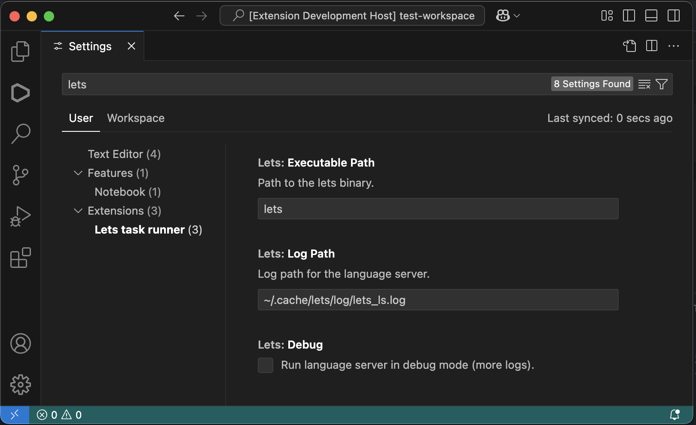

# VS Code extension for Lets task runner with Language Server support

Extension can be found [here](https://marketplace.visualstudio.com/items?itemName=kindritskyimax.vscode-lets).

## Features

### Extension

- Separate icon in ActivityBar (left)
- Commands view
- Run commands from commands view
- Clone commands with custom args

### Language server

- **Go To Definition**
  - Navigate to definitions of `mixins` files
- **Completion**
  - Complete commands in `depends`

#### Configuration

Initialization options:

- **log_path**: location for LS log

For now, you need to install `lets` binary yourself since extension does not support binary installation yet. See [Installation](#installation)

After binary installed, you can edit `Lets` extension configuration and specify binary path.

By default its `lets`. If you have any trouble with language server not starting, try to set full path to your binary.
